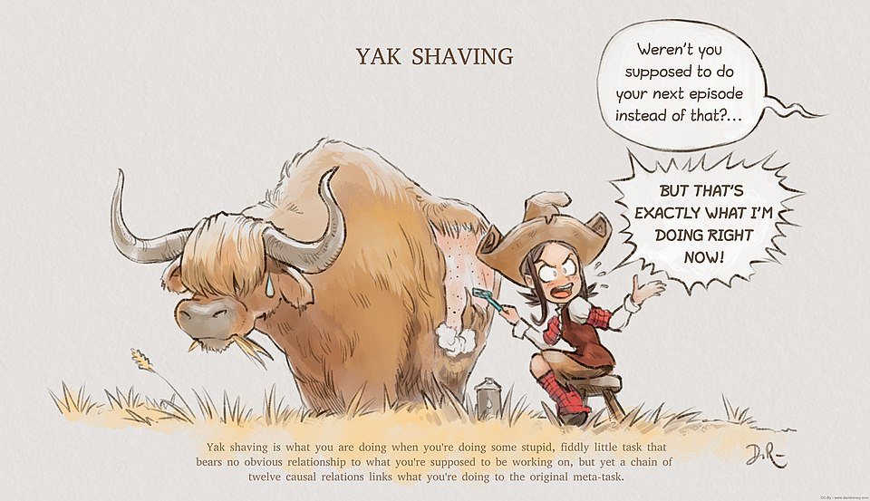

---
hide:
  - navigation
  - toc
---
# Yak Shaving

!!! abstract "Description"

    Here's yak shaving – that moment when you need to update a dependency, which requires upgrading your build tool,
    which needs a new Node version, which breaks your Docker setup... and suddenly you're three rabbit holes deep from your original task.
    
    These inevitable patterns clash hard with typical enterprise teams operating under strict backlogs and priorities:
    
    Teams with clear ownership boundaries find themselves constantly context-switching between their assigned domain and tangential technical debt (yak shaving) or getting stuck in analysis paralysis over implementation details (bike shedding), and then prioritized backlogs become exercises in frustration when high-priority user stories get derailed by debates over architectural purity or developers disappearing down dependency upgrade rabbit holes.
    
    Here's the exciting part: AI tools are becoming excellent yak shaving eliminators and bike shed deflectors.
    
    Code generation handles the boilerplate setup tasks that usually trigger yak shaving spirals. Need a new API endpoint? AI writes the scaffolding in seconds.
    Automated code reviews catch style issues without human debate, reducing bike shedding around formatting and conventions.
    
    Rapid prototyping lets teams validate ideas quickly instead of over-engineering solutions to hypothetical problems.

!!! info "References"

    [MIT Archieve](https://projects.csail.mit.edu/gsb/old-archive/gsb-archive/gsb2000-02-11.html)
